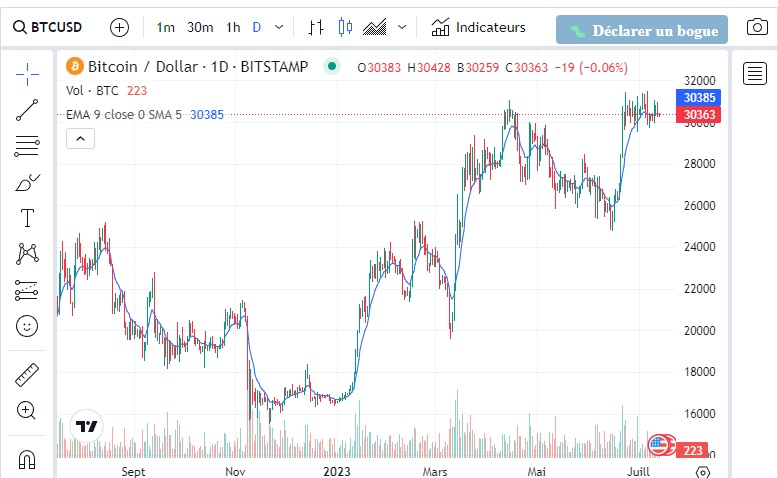

# CTF Web Client - XSS DOM TRADINGVIEW 2

## Présentation du CTF 
**ID** 25 dans **les CTFs de Cyrhades**

Récupérez le FLAG de validation en exploitant une faille XSS DOM, exercice similaire au #22 mais cette fois le développeur a pensé à mettre en httponly ses cookies d'authentification.

Dans ce challenge l'objectif est de récupérer le flag depuis la page du service technique les cookies de connexion n'étant pas accessible le flag est sur la page d'accueil.

## Aperçu

-----------

## Installation manuel
Vous n'utilisez pas l'application **les CTFs de Cyrhades** ? C'est dommage !
Mais voici comment installer ce CTF manuellement :

> git clone https://github.com/Hack-Oeil/XSS_DOM_TRADINGVIEW_2.git

> cd XSS_DOM_TRADINGVIEW_2 && docker compose up

